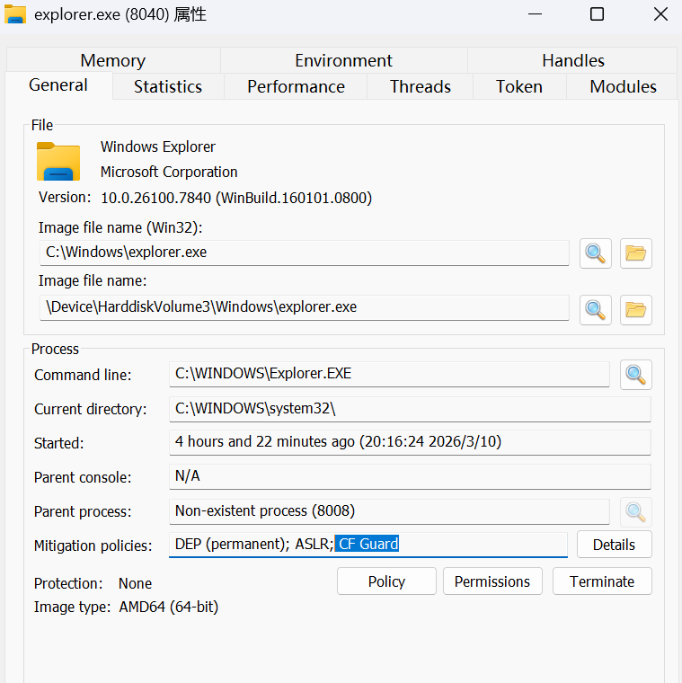
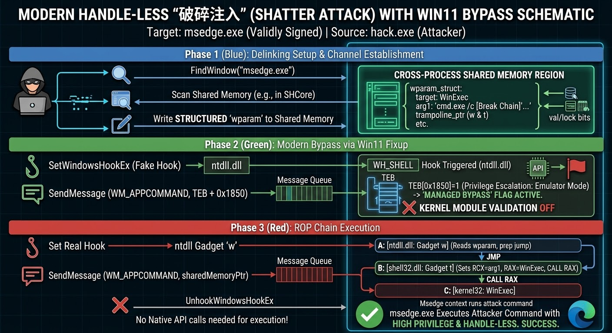

# 断开进程链 - 让Shatter Attack再次伟大

**断链**是红队攻防中的一个重点需求：想象一下这个场景，你的木马成功上线，却因为叠加了太多不可信的进程链，即使最无害的操作也被杀毒软件牢牢看住动弹不得，只好试图注入，夺舍别的进程。<br> 但是，在现代端点防护（EDR）和反作弊系统（AC）的严密监控下，传统的进程注入技术早已举步维艰。提到 `SetWindowsHookEx`，许多安全开发者的第一反应是“老掉牙”、“见光死”。

然而，近期由高级威胁组织（如 Storm-0978）和外挂开发者（Waryas）复现并开源在UC论坛 [https://www.unknowncheats.me/forum/anti-cheat-bypass/727001-usermode-bypass-framework.html](https://www.unknowncheats.me/forum/anti-cheat-bypass/727001-usermode-bypass-framework.html) 的现代版“破碎注入（Shatter Attack）”，改变了这个认知。

由于我们主要关注断开进程链的技术，本文将介绍Waryas公开的**无高危进程句柄（Handle-less）、无模块加载（DLLless）、且能绕过用户态 CFG（控制流卫士)** 的技术。

注：实际测试中对explorer / edge 等开启了CFG的窗体进程均能做到成功注入并切断进程链，Waryas的结论正确，部分文章存在微小的偏差。

---

## 一、 SetWindowsHookEx 的前世今生 {#一-setwindowshookex-的前世今生}

要理解这项技术，必须厘清它与传统窗体Hook注入的区别。

### 传统手法（已被淘汰的“直球攻击”） {#传统手法已被淘汰的直球攻击}

- **原理**：攻击者调用 `SetWindowsHookEx`，传入一个位于硬盘上的恶意 DLL（如 `Hack.dll`）路径。操作系统底层的 Loader 会被强制唤醒，将该 DLL 注入（`LoadLibrary`）到目标进程的内存空间中。
- **致命弱点**：会在目标进程的用户态 PEB（进程环境块）模块链表中留下明显的加载记录；同时，其分配的内存也会在内核态的 VAD 树（虚拟地址描述符）中留下特征异常。EDR 和反作弊的微过滤驱动拦截或扫描这种双重维度的痕迹如同探囊取物。

### 现代破碎注入（无模块 DOP/ROP） {#现代破碎注入无模块-doprop}

- **原理**：**不再加载任何外部 DLL**。它将 `SetWindowsHookEx` 仅仅作为一个**合法的执行触发器**。
- **无句柄**：传统注入需要申请 `PROCESS_VM_WRITE` 或 `PROCESS_CREATE_THREAD` 等极度敏感的高危句柄。而该技术仅需极低权限的 `PROCESS_QUERY_LIMITED_INFORMATION` 来获取基础信息，后续所有真实的“读写执行”动作，**全部依赖目标窗口句柄（HWND）和系统合法的窗口消息机制（Message Queue）完成**。这使得绝大部分依赖进程句柄监控的防护手段直接失效。

---

## 二、 核心利用细节：共享内存与 Gadget 链的配合 {#二-核心利用细节共享内存与-gadget-链的配合}

既然不加载恶意 DLL，攻击者如何将控制指令传递给目标进程？答案是**跨进程共享内存（Shared Memory）与数据导向编程（DOP）**。

### 1. 数据的桥梁：寻找天然共享内存 {#h-1-数据的桥梁寻找天然共享内存}

在 Waryas 的源码中，攻击者并没有使用敏感的 `VirtualAllocEx`，而是通过遍历目标进程的内存映射，寻找天然存在的共享内存区块（例如 `SHCore.dll` 映射的数据段，或利用 `RtlGetIntegerAtom` 强行分配的原子表空间）。<br> 这块共享内存成为了“控制信道”。攻击者在其中布置了一个包含执行参数的结构体（`wparam`）：

```cpp
struct wparam {
    uint64_t target_function; // 最终要调用的函数，如 RtlCopyString 或 malloc
    uint64_t arg1;            // 参数1 (RCX)
    uint64_t arg2;            // 参数2 (RDX)
    uint64_t trampoline_ptr;  // 跳板函数地址
    // ... 其他用于存放读写数据的缓冲区 ...
};
```

### 2. 精准引爆：Gate/Gadget 链的配合 {#h-2-精准引爆gategadget-链的配合}

攻击者在目标进程自带的 `ntdll.dll` 和 `shell32.dll` 中寻找特定的合法汇编片段（源码中的 `w` 和 `t`）：

1. **下达触发器**：利用 `SetWindowsHookEx(WH_SHELL, w, ...)` 下钩子，将回调直接指向系统合法 Gadget `w`。
2. **消息传参**：向目标窗口发送 `WM_APPCOMMAND` 消息，并将共享内存的地址作为参数传递：<br> `SendMessageA(HWND, WM_APPCOMMAND, SharedMemoryAddress, ...);`
3. **控制流劫持**：目标进程处理消息 $\rightarrow$ 触发 Gadget `w` $\rightarrow$ `w` 读取共享内存中的 `wparam` 结构体 $\rightarrow$ 跳转到跳板 Gadget `t` $\rightarrow$ `t` 将共享内存中的参数反序列化到对应的寄存器（RCX, RDX 等）$\rightarrow$ 执行最终的函数调用（如 `RtlCopyString`）。

**关于 CFG 的绕过**：由于挑选的这些跳板函数（如 `RtlpFcChangeRegistrationCallback` 或特定汇编块）本身就是系统合法的间接调用目标，且拥有标准的 `.pdata` 异常处理记录，因此系统的 CFG 校验会将其视为“安全目标”直接放行。



explorer.exe开启了CFG，但通过该攻击方法可以成功注入。

---

## 三、 演变与进化：Windows 11 24H2 的“合法后门” (Fixup) {#三-演变与进化windows-11-24h2-的合法后门-fixup}

随着 Windows 安全机制的不断收紧，系统内核对 `SetWindowsHookEx` 引入了**严格的模块验证（Module Validation）**：即声明的钩子模块（如代码中传入的 `uxtheme.dll`）必须与实际的函数地址范围一致。这本该让跨模块调用 `ntdll` Gadget 的行为被内核无情拒绝。

然而，Windows 11 24H2 (Build 26100) 为了兼容 Prism 模拟器（Emulator），在底层撕开了一个受控的“口子”。作者极其精妙地利用了这一机制：

1. **定位弱点**：计算出目标线程的 `TEB + 0x1850` 偏移，这是系统新增的“跨进程模拟”状态标志位。
2. **第一级火箭（临时越狱）**：下发一个临时的合法钩子，指向未公开系统函数 `RtlOpenCrossProcessEmulatorWorkConnection`。通过消息触发该函数后，其内部逻辑会“合法地”将 `TEB + 0x1850` 的标志位置位，强行开启模拟器特权。
3. **第二级火箭（真实注入）**：特权开启后，内核的模块验证机制被临时豁免。此时再执行真实的 Gadget 钩子，系统将不再拦截。这是一种极其高级的**逻辑状态滥用（Logic Abuse）**。

---

## 四、 局限性与实战意义 {#四-局限性与实战意义}

正如在实际测试中所发现的，这项技术并非无所不能，它有着极其明确的边界：

1. **受限的代码执行能力**：由于其完全依赖 Gadget 链对寄存器的编排，它**目前只能完美调用参数较少、结构简单的系统函数**（如 `WinExec`）。
2. **无法直接执行复杂 Shellcode**：攻击者无法将一段数百字节的复杂 Shellcode 塞入消息队列让其直接运行。
3. **实战中的真正用途**：虽然不能直接跑 Shellcode，但它足以完成**断链隐藏**功能。

---

## 五、 参数博弈与上下文之争：In-proc 与 Out-of-proc 的边界重构 {#五-参数博弈与上下文之争in-proc-与-out-of-proc-的边界重构}

先来看一张完整示意图（攻击者通过黑进程注入edge.exe调用winexec断链）



要理解代码层面的创新，我们需要直击 SetWindowsHookEx API 的四个关键参数：

```text
HHOOK SetWindowsHookExA(int idHook, HOOKPROC lpfn, HINSTANCE hMod, DWORD dwThreadId);
```

在传统注入与现代破碎注入中，攻击者对这四个参数的构造逻辑有着天壤之别。这里就涉及到了 Windows 钩子的核心概念：上下文内（In-proc）与上下文外（Out-of-proc）。

1. 传统 DLL 注入的参数（强制的 In-proc 渗透）

在传统的 DLL 注入中，攻击者的调用方式通常如下：

lpfn (钩子函数)：指向攻击者自己编写的恶意 DLL 中的导出函数。

hMod (模块句柄)：恶意 DLL 在攻击者进程中的模块句柄。

上下文机制：这是标准的 In-proc（进程内） 模式。为了让目标窗口处理消息时能执行到 lpfn，Windows 内核（Loader）别无选择，只能强行把 hMod 对应的恶意 DLL 加载（LoadLibrary）到目标进程的内存空间中。这就是为什么传统方法必带模块落地，极易被 EDR 查杀的原因。

2. 现代破碎注入的参数（Out-of-proc 控制，In-proc 执行）

现代手法的参数构造堪称“借鸡生蛋”：

lpfn (钩子函数)：传入的不再是恶意函数，而是目标进程 ntdll.dll 或 shell32.dll 中系统自带的合法汇编片段（Gadget 的地址，如代码中的 w）。

hMod (模块句柄)：传入的是系统合法的模块句柄（如代码中加载的 uxtheme.dll）。

上下文机制的颠覆：

通常，像 WH_KEYBOARD_LL 这样的低级钩子是 Out-of-proc（进程外） 的，回调在攻击者进程执行，安全但不具备直接控制目标进程内存的能力。

现代破碎注入依然使用的是 In-proc（进程内） 钩子（如 WH_SHELL），但它骗过了系统！因为它传入的 hMod 是一个目标进程早已加载的合法系统 DLL，lpfn 也是目标进程内已有的合法地址。

因此，Windows 内核认为：“哦，这个 DLL 目标进程里已经有了，不需要加载新模块，直接回调吧。”

总结这一精妙差异：

传统注入是“把木马塞进去运行”（传统的 In-proc）；而现代手法实现了 **控制流的 Out-of-proc（通过共享内存和消息发送参数）** ，而执行流使用了 **In-proc（借用系统自带的 Gadget 拼接执行）** 。 它完美剥离了恶意代码载体与执行上下文的绑定，使得 EDR 无法通过监控模块加载（Image Load Callback）来抓取注入行为。

### 结语 {#结语}

现代“破碎注入”剥离了粗糙的 DLL 加载，化身为了精密的“ROP 消息数据流”。虽然在具备完整win32k数据源采集 / InfinityHook能力的edr面前仍然会显形（ndrservercall），但足够穿透很多杀软的进程链检查。
