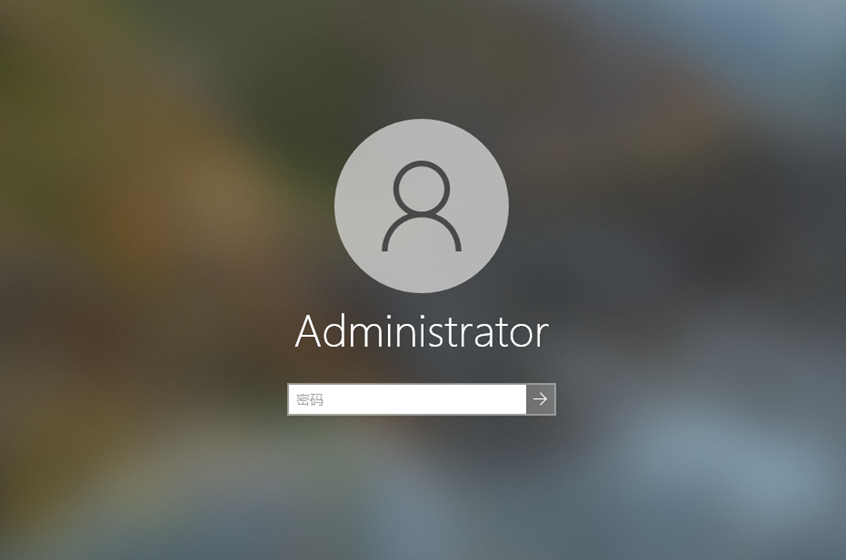
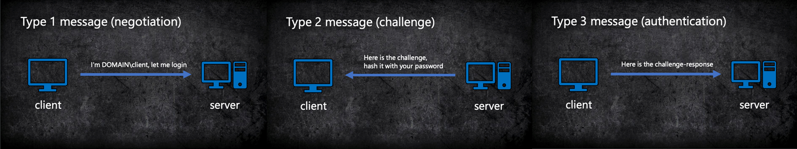
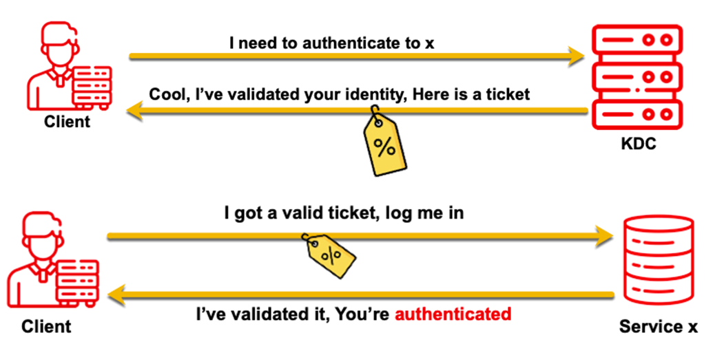
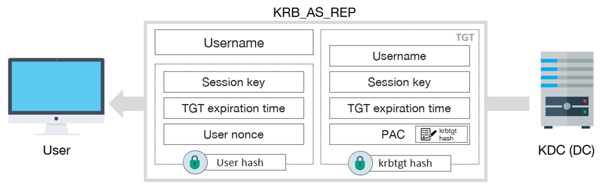
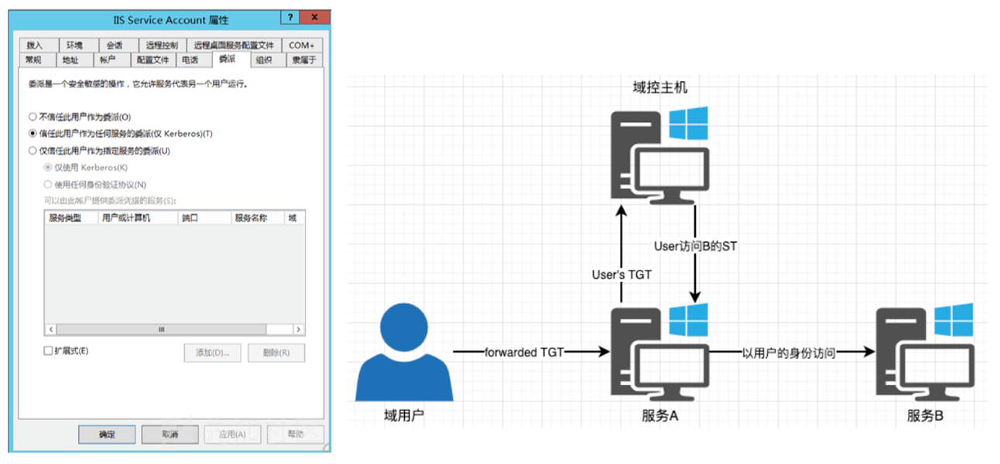
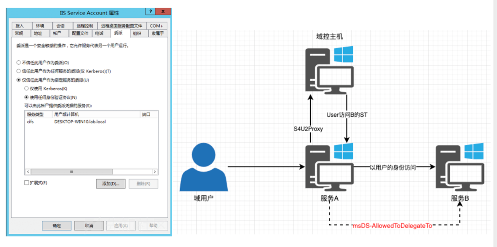
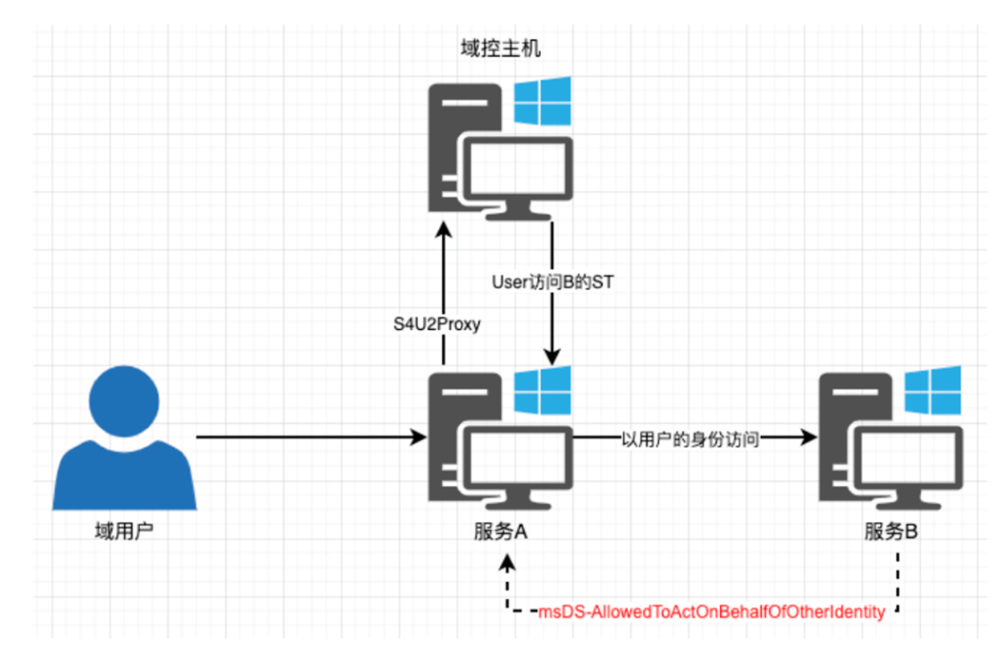

# Windows AD - 域攻防的那些事

### Part 1：域基础与 NTLM 认证 {#part-1域基础与-ntlm-认证}

#### 1. 章节说明 {#h-1-章节说明}

由于域渗透是非常复杂，和实战高度相关的一件事，因此本章无法通过枚举案例的方式进行介绍，只能先尽可能的介绍所有涉及到的基础技术，再补充具体案例。

#### 2. 工作组与域环境基础 {#h-2-工作组与域环境基础}

- **工作组 (WorkGroup)**：工作组中每台计算机的地位平等 。每台计算机拥有独立的“本机安全账户数据库”（SAM 数据库） 。例如，用户 Bob 需要登录 200 台计算机，就必须在 200 台计算机的 SAM 数据库中分别创建账号，管理成本极高 。
- **AD DS 域 (Active Directory Domain Service)**：
- 域内所有计算机共享一个集中式的活动目录（AD）数据库 。该数据库呈现类似文件目录的树状结构，用于管理和组织用户、计算机、组等逻辑容器 。
- 查询协议主要使用基于 X.500 标准的 LDAP（轻量级目录访问协议） 。
- 活动目录存储在“域控制器 (Domain Controller, DC)”中 。
- 在域环境中，每台加入域的计算机不仅有用户账号（如 `AD1\xxx`），也会在 AD 中拥有独立的计算机账号（如 `AD1\xxx-PC0$`） 。

#### 3. 组织单位 (OU)、组策略 (GPO) 与 组 {#h-3-组织单位-ou-组策略-gpo-与-组}

- **OU (Organization Unit)**：域中的容器对象，用于合并用户、计算机等实体 。
- **GPO (Group Policy Object)**：可以链接到指定的 OU 上，从而统一管理该 OU 内的对象 。
- **OU 与组的区别**：组（Group）是权限的集合，用于管理对象；而 OU 是被管理对象的集合 。例如，赋予运维高权限应使用“组”，而强制要求开发和运维修改弱密码则应将他们放入同一个“OU”并下发 GPO 。

#### 4. 服务、服务账号与 SPN {#h-4-服务-服务账号与-spn}

- **服务账号**：IIS、SQLServer 等服务在启动和身份验证时需要使用服务帐户 。可以是本地帐户（如 `NT AUTHORITY\LOCAL SERVICE`、`NETWORK SERVICE`、`SYSTEM`），也可以是域帐户 。
- **SPN (Service Principal Names)**：域内服务实例的唯一标识符 。例如 `MSSQL` 服务的 SPN 格式可能为 `SQLServer/win7.test.com:1443/MSSQL` 。
- **内网常见高频服务端口**：
- 135：WMI 自带远程管理服务（支持 MSRPC、DCOM） 。
- 137/139：NBNS / NBSS 服务（NetBIOS） 。
- 445：SMB 协议 。
- 3389：RDP 远程桌面 。
- 5985/5986：WinRM / Powershell Remoting 。

#### 5. Windows 凭据存储与本地认证 {#h-5-windows-凭据存储与本地认证}

- **凭据存储**：Windows 不存储明文密码，明文密码加密后以 NTLM Hash 形式存储 。本地账户存储在 `%SystemRoot%\system32\config\sam`，域账户存储在域控的 `ntds.dit` 数据库中 。

- **本地认证流程**：`winlogon.exe` 接收输入后，`lsass.exe` 进程将明文密码加密为 NTLM Hash，并与本地 SAM 库对比 。
- **利用**：攻击者可通过读取 `lsass.exe` 内存抓取明文密码，或读取 SAM 数据库获取 NTLM Hash，进而用于暴力破解或 PTH（哈希传递攻击） 。

#### 6. NTLM 网络认证协议 {#h-6-ntlm-网络认证协议}

NTLM 是一种基于“质询/响应 (Challenge / Response)”机制的嵌入式协议（如 NTLM over SMB / HTTP / LDAP） 。

- **步骤 1-2：协商 (Negotiate)** 。客户端通过 SMB 连接提供支持的协议版本，服务端（Session Setup Response）选择双方均支持的最高版本（如 SMB2） 。客户端发出 Type 1 请求（NTLMSSP_NEGOTIATE） 。
- **步骤 3-4：质询 (Challenge)** 。服务端收到认证请求后，生成并返回一个8 字节（64 位）位的随机数 Challenge（Type 2 消息：NTLMSSP_CHALLENGE） 。
- **步骤 5：认证 (Authenticate)** 。客户端使用认证用户的 NTLM Hash 对收到的 Challenge 进行加密，生成 Response（即 Net-NTLM Hash），发送给服务端（Type 3 消息：NTLMSSP_AUTH） 。Net-NTLMv2 的格式通常为 `username::domain:challenge:HMAC-MD5:blob` 。
- **步骤 6：服务端验证** 。
- **工作组环境**：服务端利用本地 SAM 库中的 NTLM Hash 加上已知的 Challenge 在本地计算比对结果 。
- **域环境**：服务端本身没有域用户的 Hash，它会通过 RPC NetLogon 协议将客户端的认证信息转发给 DC (域控制器)，由 DC 完成最终验证并返回 `RPC_STATUS_CODE` 。

#### 7. NTLM Relay (NTLM 中继攻击) {#h-7-ntlm-relay-ntlm-中继攻击}

攻击者处于客户端与服务端之间，通过拦截并转发 NTLM 认证的 Negotiate、Challenge、Authenticate 阶段数据包，在无需解密获取哈希的情况下获取服务端访问权限 。

实际攻击中的典型演变：

**SMB Reflect Attack**：受害者访问攻击者提供的 UNC 路径（如 `\\attacker\123`），自动发送凭据。攻击者将凭据反射回受害者的 SMB 服务以实现 RCE。此同机 SMB 到 SMB 的中继已被 MS08-068 补丁修复 。

**Hot Potato win7**：利用 HTTP 到 SMB 的跨协议中继。劫持 WPAD 使得 Windows Defender 更新流量指向本地恶意 Web 服务，Web 服务要求 401 NTLM 认证，随后将认证信息中继到本地 SMB 获得 `NT Authority/System` 权限。此漏洞被 MS16-075 修复 。

### Part 2：Kerberos 认证体系与相关攻击 {#part-2kerberos-认证体系与相关攻击}

#### 1. Kerberos 认证体系与基础概念 {#h-1-kerberos-认证体系与基础概念}

Kerberos 是一种广泛应用于域环境下的网络认证协议，主要解决域用户访问域内服务时的身份验证问题（即“Who am I”）。

**核心名词解释：**

**KDC (Key Distribution Center, 密钥分发中心)**：默认安装在域控中，并会自动创建 `KRBTGT` 账号。Kerberos 服务默认监听在 UDP/88 和 TCP/88 端口 。

- KDC 分为两个子服务：

**AS (Authentication Service)**：身份验证服务 。

**TGS (Ticket-granting Service)**：票据授予服务 。

**TGT (Ticket-granting Ticket)**：由 AS 签发，用于向 TGS 交换 ST 服务票据，可理解为用户的“临时身份证” 。

**ST (Service Ticket)**：由 TGS 签发，用于访问指定服务，可理解为“临时门票”。在部分文献中也被称为 TGS 票据 。

**PAC (Privilege Account Certificate)**：微软的拓展模块，包含在 Kerberos 票据中的授权数据字段，记录了用户的 SID、GID 等身份权限信息 。

#### 2. Kerberos 认证详细流程 {#h-2-kerberos-认证详细流程}

Kerberos 认证通常包含以下核心阶段 ：

**第一阶段：AS 认证 (获取 TGT)**

**AS_REQ**：当域用户试图访问某服务时，客户端向 AS 发送认证请求。请求内容包含：明文用户名、SPN（指定为 krbtgt），以及由**用户 NTLM Hash 加密的时间戳**（在默认开启预认证的情况下）。

- **AS_REP**：AS 收到请求后，获取对应用户的 NTLM Hash 并解密时间戳。若解密成功且时间戳未过期，则预认证通过。随后，AS 返回两部分内容给客户端：

1. **TGT**：由 **krbtgt 账号的 NTLM Hash** 加密，包含 TGS Session Key 和包含用户权限信息的 PAC 。客户端无法解密此部分 。
2. 由 **用户 NTLM Hash** 加密的 `TGS Session Key`（用于下一阶段与 TGS 通信）。

**第二阶段：TGS 认证 (获取 ST)**

- **TGS_REQ**：客户端利用自己 Hash 解密获得 TGS Session Key 后，向 TGS 发起请求。请求包含：目标服务的 SPN、由 krbtgt Hash 加密的 TGT，以及用 **TGS Session Key 加密的时间戳** 。
- **TGS_REP**：TGS 接收后，用 krbtgt Hash 解密 TGT 获取 TGS Session Key，再验证时间戳。验证有效后，TGS 返回两部分内容：

1. **ST**：由**目标服务账号 (Service owner) 的 NTLM Hash** 加密，包含 Service Session Key 和 PAC 。客户端无法解密此部分 。
2. 由 **TGS Session Key** 加密的 `Service Session Key`（用于下一阶段与 Server 通信）。

**第三阶段：AP 认证 (服务访问)**

**AP_REQ**：客户端向目标 Server 发送请求，出示 ST，以及用 **Service Session Key 加密的时间戳** 。

- Server 用自身的 NTLM Hash 解密 ST 获得 Service Session Key 和 PAC，再解密验证时间戳 。

**KERB_VERIFY_PAC**（可选）：在开启 PAC 验证的情况下，Server 会将 PAC 签名（krbtgt Hash 签名）通过 Netlogon RPC 协议发送给 DC 验证合法性，DC 返回验证结果 (RPC_STATUS_CODE)。大多数高权限服务不会向 DC 验证 PAC 。

**AP_REP**：Server 读取 PAC 中的身份信息判断访问权限，并向客户端返回结果 。

#### 3. Kerberos 相关攻击手法 {#h-3-kerberos-相关攻击手法}

基于 Kerberos 协议的交互机制，红队常用的攻击手法包括：

**Kerbrute (用户名枚举与密码喷洒)**

- **原理**：利用 `AS_REQ` 请求包中的明文用户名。若 AS 发现请求的用户名不存在，返回包会有差异，借此可无账户枚举域用户名。此外，可结合字典进行密码验证。
- **缺点**：会产生大量 `4625 - An account failed to log on` (登录失败) 报错日志。

**ASREP Roast**

- **原理**：若域用户被设置为“不要求 Kerberos 预身份验证 (Do not require Kerberos preauthentication)”，攻击者可以直接伪造该用户发起 `AS_REQ` 请求。`AS_REP` 会直接返回由该用户 NTLM Hash 加密的字段。
- **利用**：攻击者提取加密数据后，可进行离线暴力破解获取明文密码。

**PTH (Pass The Hash, 哈希传递)**

- **原理**：认证的本质依赖于 NTLM Hash。攻击者在获取用户 NTLM Hash 后，无需破解出明文即可伪造身份进行横向移动。
- **限制**：受 UAC（用户账户控制）和 KB2871997 补丁限制，通常只有本地 Administrator (SID 500) 或加入本地管理员组的域用户才能通过 PTH 实现远程代码执行 (RCE)，普通本地账户无法用于 PSEXEC 或访问 C$。

**PTT (Pass The Ticket, 票据传递)**

- **原理**：TGT 代表了用户的临时身份凭证。攻击者可以利用工具（如 mimikatz）从内存中直接 Dump 出 TGT 和 TGS Session Key，从而以该用户身份在域内活动。

**Golden Ticket (黄金票据)**

- **原理**：TGT 是由 `krbtgt` 账号的 NTLM Hash 加密的。
- **利用**：攻击者在打下域控获取 `krbtgt` Hash 后，可以取代 AS 服务自行签发 TGT，伪造任意域用户身份访问域内任意服务，常作为持久化后门。

**Silver Ticket (白银票据)**

- **原理**：ST (服务票据) 是由目标服务账号的 NTLM Hash 加密的。
- **利用**：攻击者获取某服务账号的 NTLM Hash 后，可取代 TGS 自行签发访问该特定服务的 ST。虽然攻击者没有 krbtgt Hash 导致无法在 ST 中伪造合法的 PAC 签名，但由于大多数高权限服务不会主动向 DC 验证 PAC，白银票据仍然有效。

**Kerberoasting**

- **原理**：任意域用户均可查询域内 SPN 并向服务发起 TGS 请求。`TGS_REP` 会返回由服务账号 NTLM Hash 加密的 ST。
- **利用**：如果该服务注册在普通的域用户账号下（注意：机器账号的 NTLM Hash 是随机生成且无法爆破的），攻击者导出 ST 票据后，可在本地离线暴力破解出该高权限域用户的明文密码。

### Part 3：Kerberos 委派与提权 {#part-3kerberos-委派与提权}

#### 1. Kerberos 委派机制 (Delegation) {#h-1-kerberos-委派机制-delegation}

委派是指将域内用户的权限委派给服务账号，使得服务账号能以该用户权限开展域内活动 。Kerberos 委派主要分为三种类型：无约束委派、约束委派和基于资源的约束委派 。

**无约束委派 (Unconstrained Delegation)**

- **原理**：当域用户访问配置了无约束委派的服务时，用户会在访问该服务的 ST（服务票据）中包含可转发的 TGT 。该服务会缓存用户的 TGT，并能以该用户的身份申请新的 ST 去访问其他服务 。例如，用户访问服务 A 并主动发送可转发的 TGT，服务 A 将该 TGT 转发给 KDC 换取访问服务 B 的 ST，随后以用户身份访问服务 B 。
- **配置与利用**：只有域管理员（Domain Admins）能够配置账号的无约束委派 。当攻击者在域内拿下配置了无约束委派的主机后，可以导出已缓存的票据 。如果存在其他用户的 TGT，即可通过 PTT (Pass The Ticket) 获取该用户权限 。攻击者也可以诱导其他域用户（如利用 PrintSpooler 漏洞）访问当前主机以获取其 TGT 。
- **约束委派 (Constrained Delegation)**  由于非约束委派存在安全隐患，微软在 Windows Server 2003 中引入了约束委派，并对 Kerberos 协议进行了拓展，引入了 S4U (Service for User) 协议，包含两个子协议 ：

- **S4U2Self (Service for User to Self)**：允许服务向 KDC 申请一张以任意用户身份访问自身服务的 ST 票据 。服务向 KDC 提供域用户的 name/realm，即可获得包含该用户认证信息的 ST 票据 。此协议常用于协议转换（如 HTTP NTLM 认证转换为 Kerberos 认证） 。如果服务账号设置了 `TrustedToAuthForDelegation`，通过 S4U2Self 签发的 ST 票据则是可转发的 (forwardable) 。
- **S4U2Proxy (Service for User to Proxy)**：服务可使用用户访问自身服务的可转发 ST 票据，向 KDC 申请访问其他目标服务的 ST 票据 。目标服务受到 `msDS-AllowedToDelegateTo` 属性的严格限制 。
- **配置与利用**：通常只有拥有 `SeEnableDelegation` 权限（如域管）的账户才能配置 `msDS-AllowedToDelegateTo` 属性 。当攻击者拿下配置了约束委派的服务账号后，可模拟域管身份通过 S4U2Self 发起对自身服务的请求，获得可转发的 ST，再利用 S4U2Proxy 申请访问受约束目标服务的票据，从而以域管身份访问该目标服务 。

**基于资源的约束委派 (Resource-based Constrained Delegation, RBCD)**

- **原理**：传统的约束委派是正向的（服务 A 属性指向服务 B 的 SPN），而 RBCD 是反向的，即在目标服务账号 B 的 `msDS-AllowedToActOnBehalfOfOtherIdentity` 属性中设置允许服务 A 的 SID 代表用户访问自身 。
- **特性**：在 RBCD 中，无论 S4U2Self 返回的 ST 票据是否可转发（即不需要 `TrustedToAuthForDelegation` 权限），S4U2Proxy 请求都将成功（敏感/受保护用户除外） 。
- **配置与利用**：除了域管理员外，将机器加入域的账户 (`mS-DS-CreatorSID`)、机器账户本身 (`NT AUTHORITY\SELF`)，或对目标账户拥有 `GenericAll`、`GenericWrite`、`WriteProperty`、`WriteDacl` 权限的账户均可修改此属性 。
- **攻击场景 (Windows Server 2012+ DC)**：当攻击者有权限修改目标机器账号属性时，可将 `msDS-AllowedToActOnBehalfOfOtherIdentity` 指向攻击者自己创建的服务账号（域用户可创建机器账号），随后通过 RBCD 方式以域管身份访问目标服务。在实战中，能修改该属性往往等同于实现了 RCE 。

#### 2. Shadow Credentials (影子凭据) {#h-2-shadow-credentials-影子凭据}

这是在 Windows Server 2016 及更高版本 DC 中另一种利用“修改属性实现 RCE”的高级手法 。

- **背景**：Windows Server 2016 引入了 PKINIT（Public Key Cryptography for Initial Authentication），允许在 Kerberos AS_REQ 预认证中使用非对称加密（证书信任或密钥信任），主要用于指纹或人脸解锁等无密码场景 。
- **原理**：攻击者若有权限修改目标账号的属性，即可向目标账号的 `msDS-KeyCredentialLink` 属性中写入自己生成的公钥 。随后，攻击者使用对应的私钥成功进行 PKINIT 认证，获取目标账号的 TGT 。
- **延伸利用 (Kerberos U2U)**：攻击者在获取 TGT 后，还可使用 PKINIT 进行一次 Kerberos U2U（User to User）认证，获取一张特殊的访问自身的 ST 票据 。该票据允许用户自行解密，从而直接提取 PAC 中包含的目标用户 NTLM Hash 。此技术常被用于 ACL Abuse 导致的域内横向移动 。相关自动化利用工具包括 Whisker 。

#### 3. 烂番茄与本地特权提升 (Potato 家族) {#h-3-烂番茄与本地特权提升-potato-家族}

在域环境中，低权限服务账号（如 `NT AUTHORITY\Network Service`、`IIS AppPool`）不仅具备低本地权限，在网络层面也是以机器账户身份出网的 。

- **提权原理**：Windows 的 token 是描述安全上下文的对象 。本地服务账号默认拥有 `SeImpersonatePrivilege` 特权，允许调用 `CreateProcessWithTokenW` 等 API 以特定 token 权限启动新进程 。这并非漏洞，而是微软为了让高权限服务端模拟低权限客户端执行操作所设计的系统特性 (Feature) 。
- **Potato 攻击机制**：核心思路是通过各种特性或系统机制，诱导高权限系统服务（SYSTEM）向攻击者监听的端口发起网络请求，进而窃取高权限 token 。
- **典型案例 (The Printer Bug)**：
- 打印机服务 (Printer Spooler Service) 在系统中默认开启 。该服务公开了 API 接口 `RpcRemoteFindFirstPrinterChangeNotificationEx`，其参数 `pszLocalMachine` 允许传递 UNC 路径 。
- 攻击者可利用系统路径检查的逻辑缺陷，向该参数传递类似 `\\127.0.0.1/pipe/foo` 的恶意命名管道 (named pipe) 地址 。
- 这将强制受害者机器以 SYSTEM 权限向攻击者可控的管道发起 SMB 连接 。攻击者借此窃取 SYSTEM 权限的 token 完成本地提权 。
- 此外，攻击者也可利用 SYSTEM 权限出网请求默认使用机器账号身份的特性，结合 NTLM Relay 技术攻击 Exchange 等内网核心设施 。
