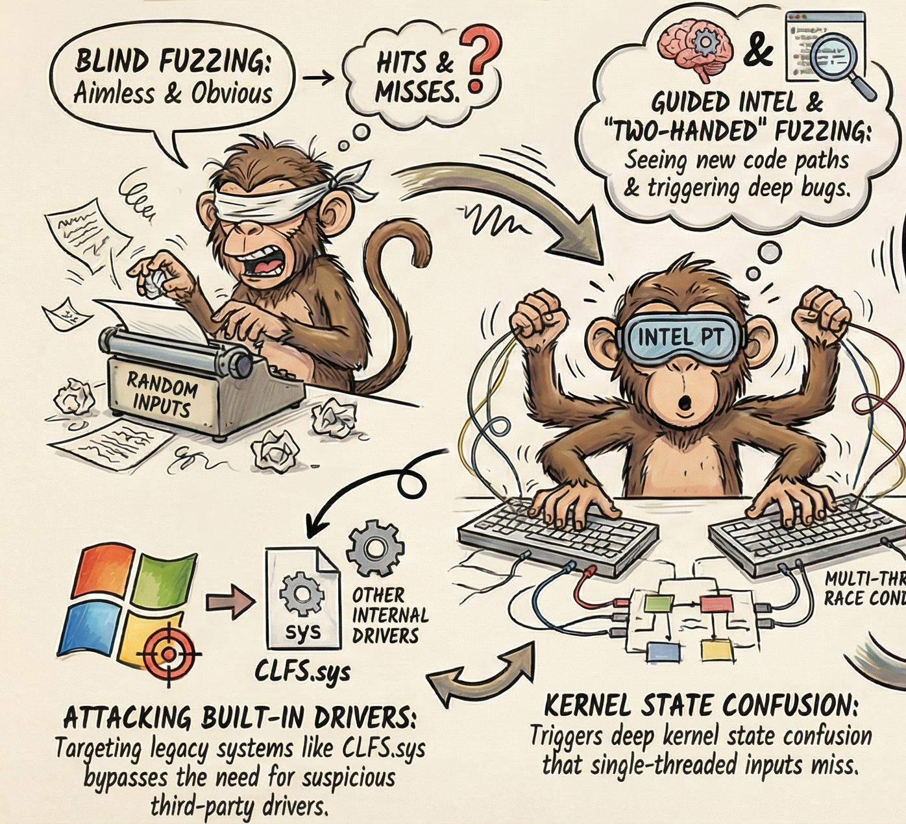
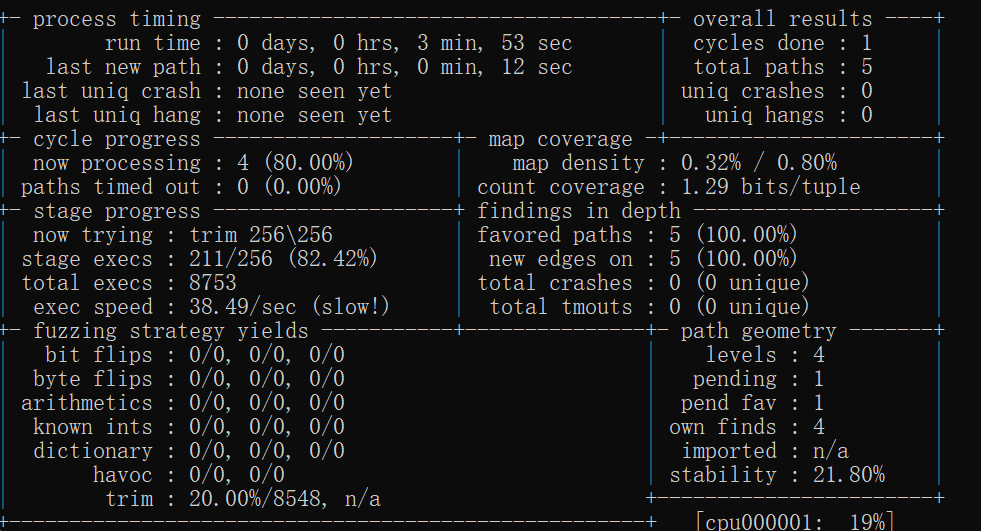
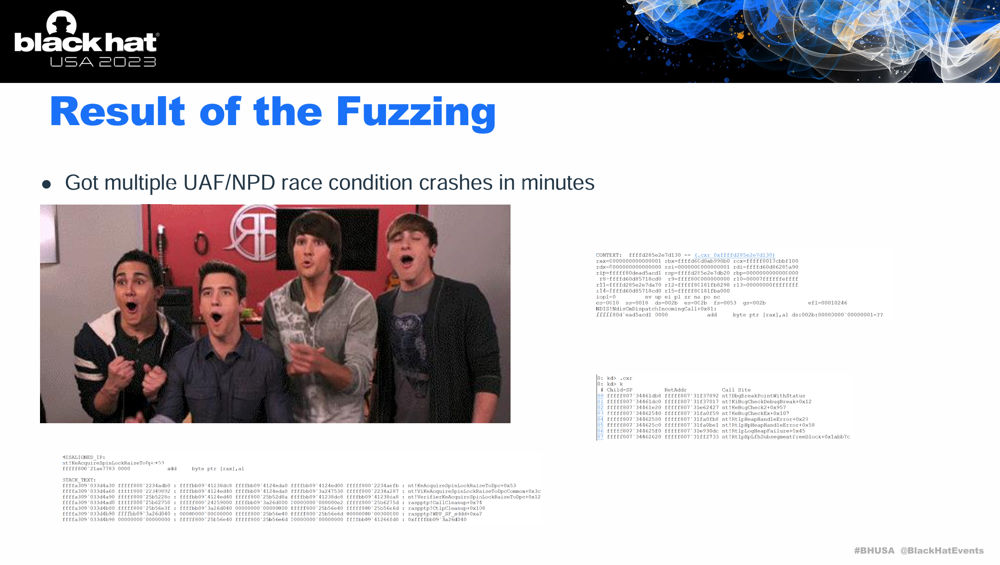
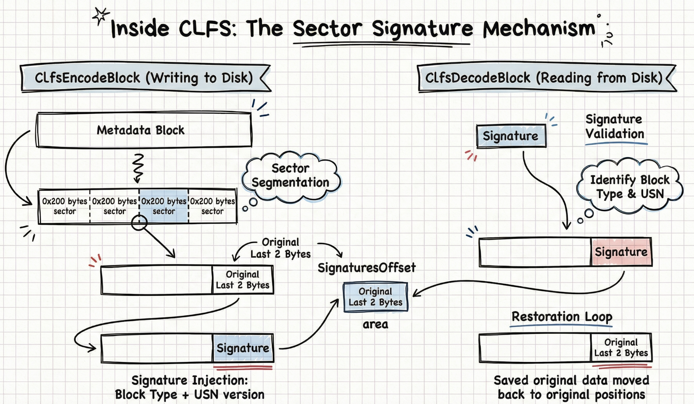
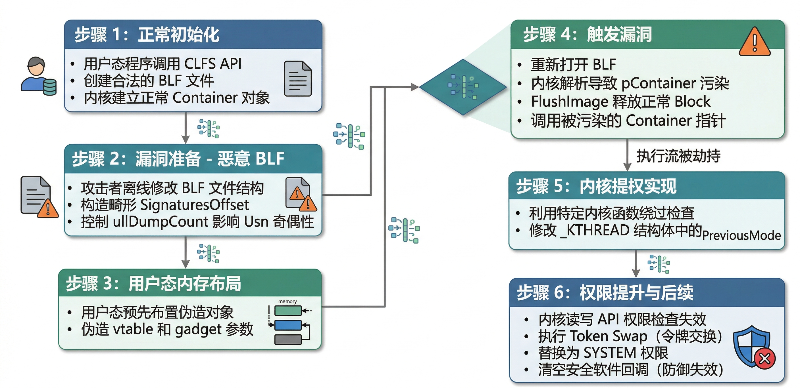

# 猴子打字 - 浅谈windows内核漏洞挖掘与edr致盲 {#猴子打字-浅谈windows内核漏洞挖掘与edr致盲}

大家都知道一个超级简单的方法可以干掉Windows上运行的安全软件：挖掘一个带有签名的驱动漏洞，把它加载到系统里，利用它拿到内核读写能力，然后把安全软件注册的所有内核回调全部抹掉——EDR直接变瞎子，看不见任何新进程、新线程、新模块的创建。如果还嫌不够，直接改EPROCESS结构体里的Protection字段，把EDR用户态进程的PPL保护剥掉，然后普通权限就能把它kill掉。但是，这太低级了，稍微像样一点的EDR，在驱动加载的瞬间就给你拦了。

事实上，根本不用加载任何第三方驱动，直接攻击windows kernel的内置驱动不就好了？<br> 而且，方法也同样简单，让猴子敲代码就好了。



这个猴子敲代码的方式，就是fuzz，即模糊测试。给程序喂大量随机输入，看它会不会崩。如果崩了，说明有bug。如果这个bug在内核驱动里，就有可能转化为一个能利用的漏洞，进而掌管全局。

但有个问题：你的猴子是个瞎子。不知道哪些敲击让驱动走了新的代码路径，哪些只是在重复已经走过的路。盲目的猴子敲一辈子也写不出莎士比亚。

问题来了：在windows平台上，有很多开源的fuzz引擎，比如honggfuzz，winafl，它们也支持代码覆盖率的计算，比如winafl支持的DynamoRIO，<br> 但它是纯用户态的插桩引擎——你的fuzzer跑在Ring 3，目标驱动跑在Ring 0，DynamoRIO根本看不见内核里发生了什么。

好在，如果你的CPU是Intel的，它在硬件层面支持一种叫Processor Trace的追踪能力——比操作系统更底层，不管代码跑在Ring 0还是Ring 3，CPU都会把分支信息写到一个ring buffer里。WinAFL有一个Intel PT模式，用法大概长这样：

```c
// 启用Intel PT追踪目标进程
IPT_OPTIONS ipt_options;
ConfigureBufferSize(options.trace_buffer_size, &ipt_options);
StartProcessIptTracing(child_handle, ipt_options);

// 目标执行完毕后，收集PT trace
PIPT_TRACE_DATA trace_data = GetIptTrace(child_handle);
collect_trace(trace_data);
```

collect_trace函数从PT的ring buffer里提取trace packets，按线程ID过滤出fuzz线程的追踪数据，然后用libipt库解码成基本块覆盖率，喂给AFL的反馈引擎。它甚至处理了ring buffer溢出的情况——当trace数据量超过buffer大小时，从溢出点之后开始截断恢复。<br> 这意味着：你的猴子不再眼盲。它每敲一次键盘，都能看见内核里的驱动代码走了哪条路径，哪些路径是新的。



不过，光是让猴子敲不一样的内容是不是还不够，敲击的姿势会有影响么？

360 Vulcan Team的Yuki Chen在Black Hat上提出了一个思路：很多内核的操作不是原子的：当多个线程同时操作同一个log文件时，内核维护的内部状态存在不一致窗口。把竞态条件引入fuzzing策略，让fuzzer用多线程同时调用内核函数，比单纯变异输入更容易触发深层的内核状态混乱。



猴子不光会敲了，它还学会了双手打字——用两个线程同时操作，让编辑在校对的时候自己乱了套。

当然，光让内核崩溃没用。崩溃只是起点。CrowdStrike在野外捕获了一个正在被APT组织使用的Windows内核漏洞：CVE-2024-49138，在一个名为CLFS.sys的模块里。它是Windows内核里一个二十年的子系统，和上期讲的Win32消息系统一样：地基太老，假设太旧，攻击面太大。让这个双手打字的猴子去进行各种姿势的敲击，就很容易砸出漏洞来。

先看CLFS的文件格式。一个BLF文件由多个metadata block组成，我们关注的是General Metadata Block，里面存着容器的上下文信息CLFS_CONTAINER_CONTEXT。这个结构里有一个pContainer字段，在磁盘上正常为0，加载到内存后，内核会把它填成一个指向CClfsContainer对象的指针。



每个metadata block按0x200字节分成若干个sector。这里有一个编解码机制：block要写入磁盘时，ClfsEncodeBlock会把每个sector末尾的2字节替换成签名——由block类型和Usn版本号拼成——被替换掉的原始数据则保存到block头部SignaturesOffset指向的区域里。读回来的时候反过来，ClfsDecodeBlock把签名换回原始数据。

这套机制正常运转的前提很简单：签名存储区和block里的关键数据不能重叠。

CVE-2024-49138就是让它们重叠了。攻击者构造恶意BLF，把SignaturesOffset设置成一个精心计算的值，让encode写入sector签名时，签名字节恰好落在CLFS_CONTAINER_CONTEXT的pContainer字段上。encode完成后，pContainer不再是0，而是被签名字节污染成了一个攻击者可预测的值。

第二刀更精妙：通过控制BLF里的ullDumpCount字段——它的奇偶性决定了Usn是否递增——攻击者制造出一个状态：ClfsEncodeBlock能正常完成，但紧接着的ClfsDecodeBlock因为Usn不匹配而校验失败。decode失败后，代码进入错误处理路径，尝试释放metadata block，但由于block类型和引用计数的关系，释放并没有真正生效——block带着被污染的pContainer继续留在内存里。

最后一击：攻击者把容器的eState设为ClfsContainerInitializing。这个状态会在后续流程中触发FlushImage，FlushImage释放了底层的block，但LoadContainerQ函数不知道这件事——它继续拿着那个被签名字节污染的pContainer当作合法的CClfsContainer指针，去调用它的虚函数。

这就是一个经典的Use-After-Free：内核使用了一个已经被释放、且内容被攻击者控制的对象指针。难点在于怎么把这个UAF变成任意内核读写——这需要精确的内存布局控制。

```c
// 在用户态的精确地址分配内存，伪造CClfsContainer对象
auto pcclfscontainer = VirtualAlloc((LPVOID)0x2100000, 0x1000,
    MEM_RESERVE | MEM_COMMIT, PAGE_READWRITE);
// 构造fake vtable
auto vtable = (DWORD64)pcclfscontainer + 0x100;
*(PDWORD64)pcclfscontainer = (DWORD64)vtable;
// vtable[1] 指向 PoFxProcessorNotification — 一个合法的内核函数
// 它会作为跳板，最终把执行流引导到 DbgkpTriageDumpRestoreState
((PDWORD64)vtable)[1] = (DWORD64)g_ntbase + POFXPROCESSORNOTIFICATION_OFFSET;
```

逻辑是这样的：

UAF发生后，freed的pContainer字段被攻击者控制的数据覆盖，指向用户态地址0x2100000处预先布置好的假对象。内核以为这还是一个合法的CClfsContainer，调用它的虚函数——但vtable已经被替换了。

执行流跳转到PoFxProcessorNotification，它作为跳板把控制权转交给DbgkpTriageDumpRestoreState——这个函数有一个副作用：它会在参数指向的地址偏移0x2078处写入另一个参数控制的值。

写什么？写当前线程的_KTHREAD.PreviousMode。从1改成0，从UserMode改成KernelMode。

```text
*((PDWORD64)(arg)) = (DWORD64)address_to_write - 0x2078;
*((PDWORD64)((PCHAR)arg + 0x10)) = 0x0014000000000f00;
```

PreviousMode是Windows内核用来判断系统调用来源的标志。等于1表示来自用户态，内核会检查你有没有权限访问目标地址；等于0表示来自内核自身，直接放行。改完之后，NtReadVirtualMemory和NtWriteVirtualMemory会把你的调用当成来自内核——所有内存访问权限检查直接跳过。拿着这把尚方宝剑大杀四方：

让我们来看看整个过程：



所以，回到标题：培养你的猴子，并让它敲代码，就能让安全软件拉闸。不用绞尽脑汁去加载第三方驱动，怎么样，是不是超级简单，什么：你说太难了，还没有思路？那我送你一个：

在最新的Windows 11 Build 26200上，CLFS的ExtendMetadataBlock有一条crash-recovery路径，里面有几个有趣的问题：

control_record偏移0x84处的state字段，值可以是0、1、2，从BLF文件直接读取后**没有任何验证**就用于switch分发。ExtendMetadataBlockDescriptor在做memmove时，拷贝大小直接取自block descriptor的size字段——这个值来自磁盘上的文件数据——没有和实际分配的内存大小做交叉校验。ProcessCurrentBlockForExtend使用的shift amount只检查了整数溢出，不检查值本身是否合理。

最关键的：微软的缓解措施Feature_ClfsCreateLogFileCorruptMetadata_Fix**不覆盖ExtendMetadataBlock这条路径**。这个flag只在LoadContainerQ和ValidateContainerContextOffsets里被引用。

剩下的，就交给你的猴子了。

猴子们还在打字。区别只是，有的猴子在看自己敲出了什么，有的只是在砸键盘。
