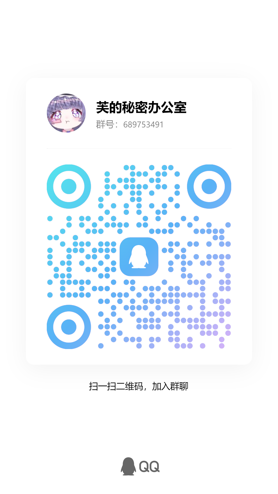

# Redteam Wiki - 首页

## Red Team 实践指南：从入门到实战 {#red-team-实践指南从入门到实战}

### 📖 关于本项目 {#关于本项目}

**本项目旨在创建一个免费、面向实战、新手友好的“红队”攻防技术入门指南。**

我们的核心目标是：**帮助新手快速了解真实世界中的攻防思路、流程和关键技术，避免在大部头理论面前无所适从。**

**本项目不会提供任何可以直接运行来用于攻击的完整代码、EXP或Payload。** 所有代码片段（如果有）仅用于辅助理解原理。

**对复现极为必要的demo或代码poc将通过引用第三方代码仓库的形式进行，但请注意一定在虚拟环境中运行这些demo和代码。**

**本项目所有的内容、知识、技术讲解仅供学习、研究和交流之用，严禁用于任何非授权或非法目的。**

### 🎯 适合人群 {#适合人群}

对红队、渗透测试、攻防对抗有浓厚兴趣的**新手/零基础学习者**。

### 🤝 贡献者清单（截止至2025-12-26） {#贡献者清单截止至2025-12-26}

[芙蕾德莉卡](https://space.bilibili.com/3546802936613706)  (项目维护者)

[黑兔由帝](https://space.bilibili.com/351510324)  负责章节:Web渗透，从正面创造突破口

### 🤝 加入我们 {#加入我们}

本项目是一个持续更新、不断完善的项目。欢迎您以各种方式加入我们，共同构建这份指南：

由于项目维护者精力有限（工作、直播、视频制作、维护本项目、治疗ADHD），因此部分内容将通过aigc技术辅助生成。

如果您发现任何知识点错误、内容模糊、名词拼写错误，或者有好的知识点讲解、实战思路分享，欢迎提建议帮助我们完善。

**致谢：** 感谢每一位对本项目贡献力量的参与者，您的支持是项目持续发展的动力！

**开支：**本项目的域名和服务器费用将从芙蕾德莉卡的直播收入中扣除，相关数据公示在[芙蕾德莉卡的直播收益](https://frederica-vtuber.github.io/)

**联系方式：** 本项目暂时通过芙蕾德莉卡的粉丝群驱动，如果您有任何额外意见，也可通过站内信反馈 [芙蕾德莉卡的个人主页](https://space.bilibili.com/3546802936613706)

{ width="31.24%" }
